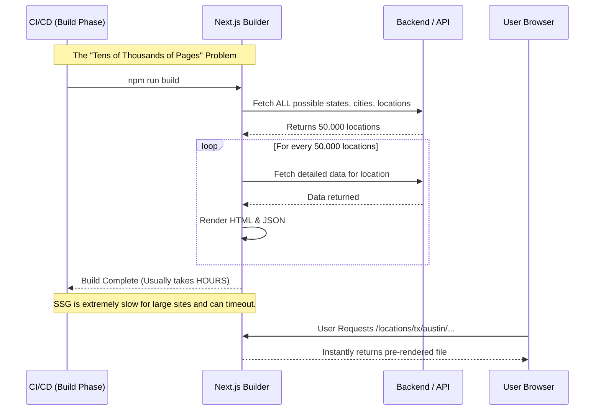
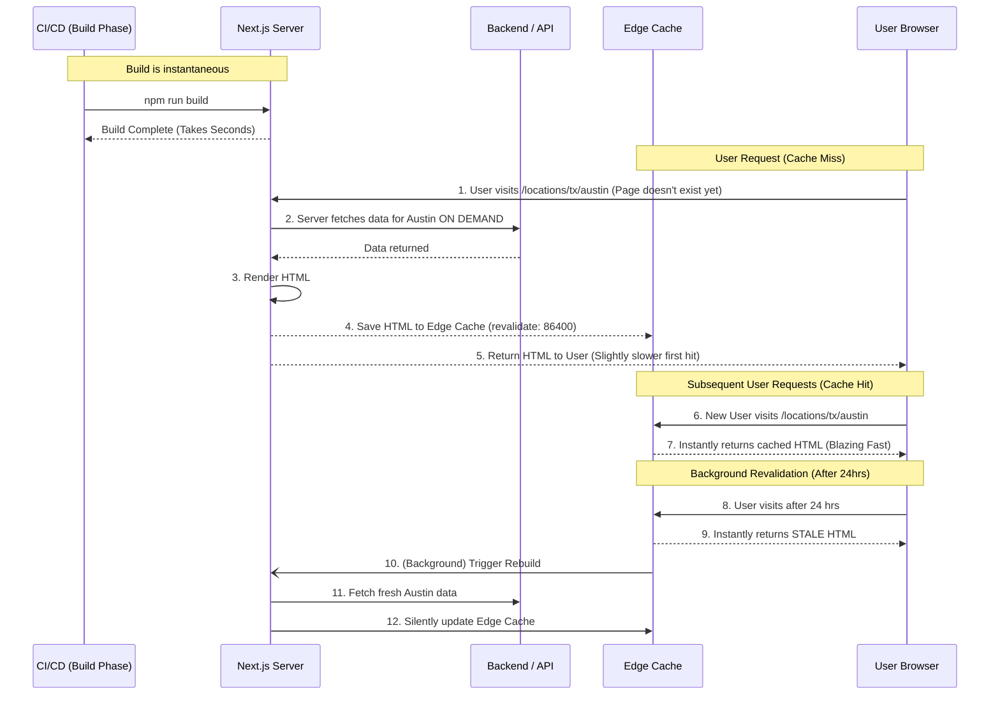

# Architectural Analysis and Rendering Strategies

This document provides a comprehensive analysis of the current frontend architecture, with guidelines for component rendering, strategies for highly dynamic pages, and a visual workflow of the application.

## 1. Component Strategy: Server vs. Client Components

Next.js App Router sets components to **Server Components** by default. This is excellent for SEO, performance, and keeping bundle sizes small. You only need to opt into **Client Components** using `"use client"` when necessary.

### Current State

Based on the codebase analysis, `"use client"` is correctly being used sparingly in interactive pages and components (e.g., `/schedule`, `/auth` pages, and specific `/help` or `/locations` interactive elements).

### Guidelines for the Team

To decide whether a component should be Server or Client, follow this cheat sheet:

**Use Server Components (Default) when:**

- Fetching data from a backend API or database.
- Accessing backend resources directly.
- Keeping sensitive information (access tokens, API keys) on the server.
- The component only relies on static data or props and doesn't need interactivity.
- Returning large dependencies that shouldn't go to the client.

**Use Client Components (`"use client"`) when:**

- You need interactivity and event listeners (`onClick`, `onChange`, etc.).
- You are using React hooks (`useState`, `useEffect`, `useReducer`, `useContext`).
- You are using browser-only APIs (`window`, `document`, `localStorage`).
- You are using custom hooks that depend on state, effects, or browser APIs.
- You are using React Class components (though functional components are preferred).

**Best Practice:** Push Client Components as far down the component tree as possible. If a [page.tsx](file:///s:/RIVON/searshomeservices/app/page.tsx) needs some interactive state, extract the interactive part into a separate Client Component (`<InteractiveForm />`) and import it into the Server Component page. This keeps the data fetching and static layout on the server.

---

## 2. Dynamic Route Strategy

The application has a complex routing structure with highly nested dynamic routes.
For example, the Locations feature follows this structure:
`/locations/[state]/[city]/sears-appliance-repair/[location]`

This means there could theoretically be tens of thousands of pages for every city and repair location in every state.

### Rendering Approach

Because there are thousands of potential pages, rendering them all at build time (Static Site Generation / SSG using `generateStaticParams`) is **not recommended**. It would make your build times incredibly long.

Instead, you should use **Incremental Static Regeneration (ISR)** or **Server-Side Rendering (SSR) with robust caching**.

#### Recommendation: ISR (Time-Based + On-Demand)

ISR is the optimal approach for these dynamic pages. It allows Next.js to generate the page the first time a user requests it, cache it on the edge network (CDN), and then serve the fast, cached version to all subsequent users.

**Implementation Steps for Dynamic Pages (`app/locations/.../page.tsx`):**

* **Do not use `generateStaticParams`** (or only use it for the top 50 most popular cities to pre-warm the cache).

**Add Time-Based Revalidation:**

```typescript
// In page.tsx and layout.tsx of dynamic routes
export const revalidate = 86400; // Revalidate every 24 hours (86400 seconds)
```

*Since location data, help center articles, or deep blogs don't change by the minute, a 24-hour cache is usually safe and extremely performant.*

**Handle 404s cleanly:** Because routes are generated on demand, you must ensure your data fetch handles invalid urls (e.g., `/locations/fake-state/fake-city`). If the data fetch returns null, explicitly call `notFound()`.

```typescript
import { notFound } from "next/navigation";

export default async function LocationPage({ params }) {
  const data = await fetchLocationData(params);
  if (!data) return notFound(); // Shows the 404 page
  // ... render component
}
```


---

## 3. Visual Workflow (Architecture Flowchart)

Below is a visual representation of how a user request flows through the Next.js App Router architectural strategy recommended above.

```mermaid
flowchart TD
    User([User Request]) --> Router[Next.js App Router]
  
    %% Routing Logic
    Router -->|Static Route (e.g. / , /about)| StaticCache{CDN Cache exists?}
    Router -->|Dynamic Route (e.g. /locations/[state])| DynamicCache{ISR Cache exists\nand is fresh?}

    %% Static Route Flow
    StaticCache -->|Yes| FastResponse1[Serve pre-rendered HTML instantly]
    StaticCache -->|No| Build[Should have been built at build time]

    %% Dynamic Route Flow
    DynamicCache -->|Yes| FastResponse2[Serve cached HTML instantly]
    DynamicCache -->|No| ServerComponent[Server Component Execution]

    %% Server Execution
    ServerComponent --> DataFetch[Fetch Data from API/DB]
    DataFetch --> Check404{Data Exists?}
    Check404 -->|No| Render404[Render 404 notFound]
    Check404 -->|Yes| RenderServer[Render Server Components]
  
    RenderServer --> SendHTML[Send HTML + RSC Payload to Client]
  
    %% Client Side
    SendHTML --> ClientHydration[Client Components Hydrate]
    ClientHydration --> Interactivity[User Interacts (useState, Event Listeners)]
  
    %% Background Revalidation
    DynamicCache -->|Cache Stale| Background[Trigger Background Regeneration]
    Background -.-> ServerComponent
```

---

## 4. SSG vs. ISR: A Visual and Technical Proof

To understand why ISR is faster and more reliable for a project with tens of thousands of dynamic routes (like `/locations/[state]/...`), we must compare how Static Site Generation (SSG) and Incremental Static Regeneration (ISR) handle the build process and user requests.

### 4.1. The SSG Approach

In SSG, you tell Next.js to pre-render **every single possible page** during the build stage (via `generateStaticParams`).

**Visual Workflow for SSG:**



**Why SSG Fails Here:**

1. **Atrocious Build Times:** Fetching and rendering 50,000 pages at build time will take an incredible amount of time (potentially hours) and consume massive CI/CD memory.
2. **Brittle Builds:** If the backend API times out or rate-limits requests during the loop of 50,000 requests, the entire Next.js build **fails**. You cannot deploy.
3. **Stale Data:** To update one location's spelling error, you must trigger a full rebuild of all 50,000 pages.

---

### 4.2. The ISR Approach

In ISR, you **do not** render the tens of thousands of pages at build time. You only build the core shell, and maybe the top 10 most popular locations. The rest are generated *on-demand*.

**Visual Workflow for ISR:**



**Why ISR is the Reliable & Fast Choice:**

1. **Lightning Fast Builds:** Because you skip pre-rendering 50,000 pages, your build finishes in seconds. You can ship hotfixes immediately.
2. **High Reliability:** If the backend goes down during a background revalidation, ISR is smart enough to catch the error and keep serving the old cached page instead of breaking the site.
3. **Virtually the Same Performance:** The very first user to hit an un-cached page experiences a short SSR delay (maybe 500ms). But every user after them, for the next 24 hours, gets the page instantly from the CDN edge cache. The performance is identical to SSG for 99.9% of traffic.
