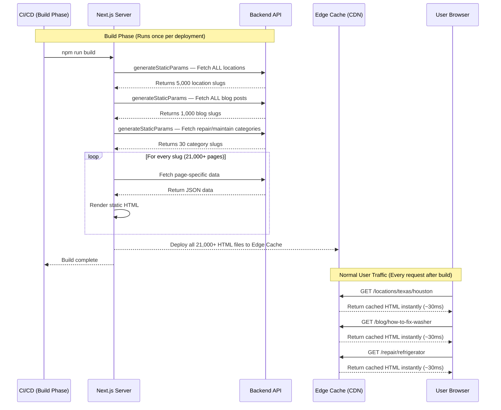
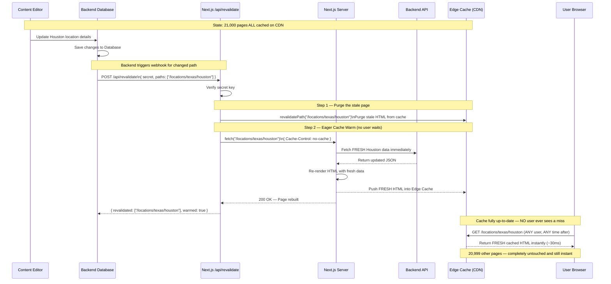

# Full SSG + Webhook Revalidation Plan

## Goal

Pre-build **every page** (static and dynamic) at build time so all users get instant ~30-80ms responses. When data changes in the database, the backend sends a webhook to the Next.js server, which regenerates **only the affected pages** without a full rebuild.

> [!IMPORTANT]
> This approach requires a working backend API that serves all location, blog, repair, and maintenance data at build time. The backend must also be configured to send webhooks when data changes.

---

## Detailed Sequence Diagrams

### Diagram 1 — Build Phase + Normal User Traffic

**What each participant means in the real world:**

| Participant                   | In the Diagram                                              | Real-World Equivalent                                                                                                        |
| ----------------------------- | ----------------------------------------------------------- | ---------------------------------------------------------------------------------------------------------------------------- |
| **CI/CD (Build Phase)** | The automated machine that runs your build                  | GitHub Actions, Vercel deploy pipeline, or any deployment server                                                             |
| **Next.js Server**      | The brain of the website — compiles and renders every page | The Node.js process running on your hosting server (e.g. Vercel)                                                             |
| **Backend API**         | The place where all your business data lives                | Your own custom backend server or a CMS like Sanity/Contentful that stores locations, blog posts, and services               |
| **Edge Cache (CDN)**    | A global network of super-fast storage boxes                | Vercel Edge Network, Cloudflare CDN — stores copies of HTML files in data centers worldwide (London, New York, Dubai, etc.) |
| **User Browser**        | The person visiting your website                            | Any real visitor to searshomeservices.com on their phone or laptop                                                           |

> **In simple words:** The build machine tells Next.js to cook all 21,000 pages. Next.js asks the Backend API for the ingredients (data), cooks the HTML, and ships every page to the CDN warehouse. From that point on, every user around the world just picks up their pre-cooked page from the nearest CDN warehouse in ~30ms.

---

### Diagram 2 — On-Demand Revalidation (Webhook Flow)

**What each participant means in the real world:**

| Participant                       | In the Diagram                                                                 | Real-World Equivalent                                                                                                                                                                                       |
| --------------------------------- | ------------------------------------------------------------------------------ | ----------------------------------------------------------------------------------------------------------------------------------------------------------------------------------------------------------- |
| **Content Editor**          | A non-technical person updating content                                        | Marketing team member updating a blog post or service detail in the CMS dashboard                                                                                                                           |
| **Backend Database**        | The storage system for all content and data                                    | Your database + backend server (e.g. PostgreSQL + Node.js API, or a Headless CMS like Sanity)                                                                                                               |
| **Next.js /api/revalidate** | A special locked door on the Next.js server that only the backend can knock on | A secure API endpoint (`app/api/revalidate/route.ts`) — its **only job** is to receive the "data changed" signal and coordinate the cache refresh. It is NOT a webpage — it is a backend listener |
| **Next.js Server**          | The page rendering engine                                                      | The same Node.js server as above, but here it acts as the**page renderer** — it fetches fresh data and rebuilds the HTML for the affected page                                                       |
| **Backend API**             | The data source                                                                | Your backend server that provides the fresh, updated page data after a content change                                                                                                                       |
| **Edge Cache (CDN)**        | The global fast-delivery storage                                               | The CDN network that holds the pre-built HTML pages and delivers them to users worldwide                                                                                                                    |
| **User Browser**            | The end visitor                                                                | Any visitor on your website                                                                                                                                                                                 |

> **In simple words:** The content editor changes data in the CMS. The CMS knocks on the Next.js fire door (`/api/revalidate`). Next.js verifies the knock is legitimate, deletes the old page from the CDN warehouse, immediately cooks a fresh version, and puts it back on the shelf — all before any real visitor arrives.

---

## Trade-offs to Be Aware Of

> [!WARNING]
> **Build time will be long.** Pre-building ~21,000 pages will take significant time (potentially 30-60+ minutes depending on your backend API speed and CI/CD resources). Every new deployment requires this full build.

> [!NOTE]
> **Adding new pages requires a rebuild.** If a brand new location or blog post is added to the database, `dynamicParams = false` will return 404 for it until the next full rebuild. To avoid this, you can set `dynamicParams = true` on specific routes to allow on-demand generation of truly new pages.
