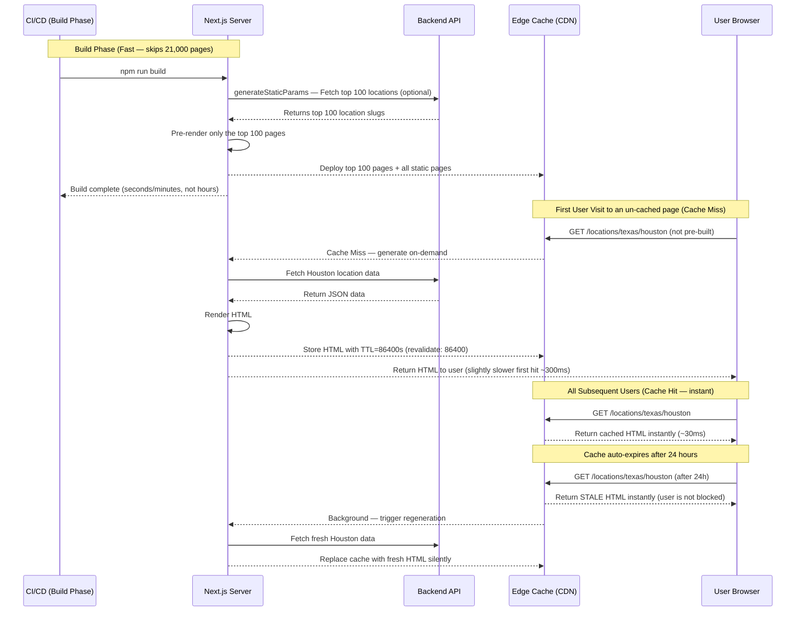
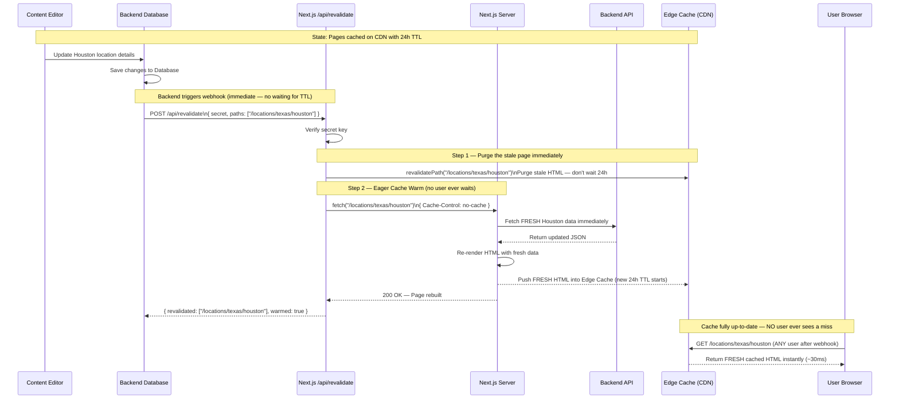

# ISR (Incremental Static Regeneration) + Webhook Revalidation Plan

## Goal

Generate pages **on-demand** when first visited and cache them on the CDN with a time-based TTL (e.g., 24 hours). When the backend data changes, a webhook instantly purges and re-warms the affected pages. No full rebuild is required for new or updated pages — the site scales to any number of pages without long build times.

> [!IMPORTANT]
> This approach requires a running Next.js server at all times (not pure static export). It is ideal for sites with thousands of dynamic pages where build times with full SSG would be unacceptably long.

---

## How ISR Works in This Approach

```
Build time  → Only pre-build a small set of "Top N" pages (optional)
              All other pages: generated on first user visit → cached on CDN

Runtime     → Cache Hit  → Instant ~30ms response (same as SSG)
              Cache Miss → Server renders on-demand → cached for next visitor

Revalidation → Time-based: page auto-refreshes after TTL expires (e.g. 24h)
               On-demand:  webhook fires → instant cache purge → eager re-warm
```

## Detailed Sequence Diagrams

### Diagram 1 — Build Phase + First User Visit (Cache Miss) + Subsequent Users (Cache Hit)



**What each participant means in the real world:**

| Participant                   | In the Diagram                             | Real-World Equivalent                                                    |
| ----------------------------- | ------------------------------------------ | ------------------------------------------------------------------------ |
| **CI/CD (Build Phase)** | The automated machine that runs your build | GitHub Actions, Vercel deploy pipeline                                   |
| **Next.js Server**      | Renders pages on-demand and serves the app | Node.js process running on Vercel/your server                            |
| **Backend API**         | Source of all page data                    | Your custom backend or Headless CMS (Sanity, Contentful)                 |
| **Edge Cache (CDN)**    | Global fast-storage for rendered pages     | Vercel Edge, Cloudflare — stores HTML files close to each user globally |
| **User Browser**        | The website visitor                        | Any visitor on their phone or laptop                                     |

> **In simple words:** The build finishes in minutes because it skips the 21,000 pages. The first person to visit any uncached page waits ~300ms while the server cooks it fresh. After that, it's stored at the CDN warehouse and every future visitor gets it in ~30ms. After 24 hours the page auto-refreshes in the background — the visitor never waits.

---

### Diagram 2 — On-Demand Revalidation (Webhook + Eager Cache Warm)



**What each participant means in the real world:**

| Participant                       | In the Diagram                                                    | Real-World Equivalent                                                                                 |
| --------------------------------- | ----------------------------------------------------------------- | ----------------------------------------------------------------------------------------------------- |
| **Content Editor**          | Non-technical person updating content                             | Marketing team editing a blog post or location info in the CMS                                        |
| **Backend Database**        | Where all content is stored                                       | PostgreSQL/MySQL database managed by your backend team                                                |
| **Next.js /api/revalidate** | The "fire alarm receiver" — only listens for data-change signals | Secure API route (`app/api/revalidate/route.ts`) — NOT a webpage, purely a backend signal listener |
| **Next.js Server**          | The "kitchen" — renders fresh HTML when asked                    | Same Node.js process, acting as page renderer this time                                               |
| **Backend API**             | Provides fresh data after a change                                | Your backend REST/GraphQL API                                                                         |
| **Edge Cache (CDN)**        | Global fast-storage warehouse                                     | Vercel/Cloudflare CDN nodes worldwide                                                                 |
| **User Browser**            | The website visitor                                               | Any real visitor                                                                                      |


> **In simple words:** The content editor updates the CMS. The CMS immediately knocks on the Next.js fire door. Next.js discards the old cached page, instantly cooks a fresh one, and puts it back on the shelf — all before the next visitor arrives. The 24-hour timer resets from zero.

---

## Verification Plan

### Build Test

1. Run `npm run build`
2. Build should complete in **minutes** (not hours) — confirm in terminal output
3. Only pre-built pages should be listed (top 100 locations + all static pages)

### ISR On-Demand Test

1. Start the server: `npm run start`
2. Visit a page that was NOT pre-built: `/locations/alabama/birmingham`
3. First visit: slightly slower (~300ms) — page generated on-demand
4. Second visit: instant (~30ms) — served from CDN cache
5. Check response headers: `x-nextjs-cache: MISS` on first, `HIT` on second

### Time-Based Revalidation Test

1. Set `revalidate = 10` temporarily (10 seconds for testing)
2. Visit the page — note the content
3. Update data in the backend
4. Wait 10 seconds, visit again — page should auto-refresh in background
5. Third visit — should show fresh content

### Webhook Test

1. Call the webhook: `curl -X POST http://localhost:3000/api/revalidate -H "Content-Type: application/json" -d '{"secret":"your-secret","paths":["/blog/test-post"]}'`
2. Verify response: `{ "revalidated": ["/blog/test-post"], "warmed": true }`
3. Visit `/blog/test-post` — should immediately show updated content (no waiting)

---

## Trade-offs to Be Aware Of

> [!NOTE]
> **First visitor delay.** The very first person to visit any un-cached page experiences a slight delay (~200-500ms) while the server renders it. This only affects long-tail pages that no one has visited yet.

> [!TIP]
> **Use `generateStaticParams` for your top 100 pages** to eliminate the first-visitor delay for your most important routes. All other pages remain ISR (on-demand).

> [!WARNING]
> **Requires a running server.** Unlike pure SSG which can be hosted as static files on an S3 bucket, ISR needs a Node.js server running at all times to handle cache-miss renders. This means slightly higher hosting costs compared to pure static.

> [!NOTE]
> **New pages appear automatically.** With `dynamicParams = true`, a newly added blog post or location page becomes instantly accessible without any rebuild — it gets generated on the first visit and cached. This is a key advantage over the SSG approach.

---

## SSG vs ISR — Quick Comparison for This Project

| Factor                          | SSG + Webhook                 | ISR + Webhook                   |
| ------------------------------- | ----------------------------- | ------------------------------- |
| Build time                      | 30-60+ minutes (21,000 pages) | Minutes (only top 100 + static) |
| First user on new page          | Instant (pre-built)           | ~300ms (generated on-demand)    |
| First user on existing page     | Instant                       | Instant                         |
| New pages (e.g. new city added) | 404 until next rebuild        | Auto-appears on first visit     |
| Data update without webhook     | Stale until rebuild           | Auto-refreshes after TTL        |
| Data update with webhook        | Instant (purge + warm)        | Instant (purge + warm)          |
| Hosting requirement             | CDN only (can be static)      | Requires Node.js server         |
| Hosting cost                    | Lowest                        | Slightly higher                 |
